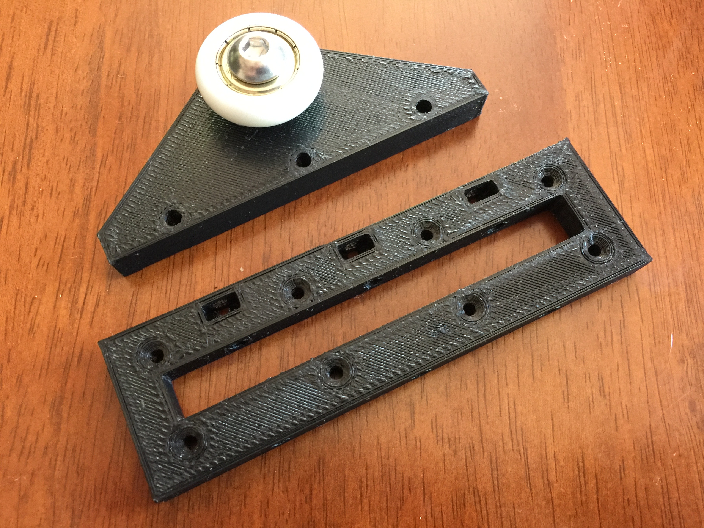

# Hanging Door Roller

This repository contains parts to mount a sliding door on a rail.

## Motivation

When I was renovating my house, I had to remove the sliding doors. The existing sliding door was hanging too low for the new carpet and underlay (it's a few mm thicker) and the existing bracket did not have the range of adjustment to suit the thicker carpet. Understandably, after 20 or so years, the rubber wheels were perished too. I looked at what was available in New Zealand and not only were the replacements pretty expensive, they wouldn't really suit the poor installation of the existing doors.

The rails in my house are mounted too high into the wall and it's not possible to simply remove the door by unhooking it and lifting it off. The design of the included part allows you to install the wheel bracket separately from the door, and then attach them. This process is difficult but I'm not sure if there is an alternative, and it does work.

## Parts Required

These parts are for one roller, you'll need two rollers per door minimum.

- 3x M4 36mm bolts and nuts for joining the base with the bracket.
- 1x [M8 20mm bolt for mounting the wheel](https://www.aliexpress.com/item/304-stainless-steel-round-mushroom-Hexagon-Hexagon-M8-20mm/32357038228.html).
- 1x [M8 wheel](https://www.aliexpress.com/item/10PCS-Free-Shipping-608zz-bearing-coated-POM-cashbox-roller-shutter-8mm-30mm-8-5mm-shower-glass/32594047772.html).

## Instructions

The best method is to get everything ready - wheels on the rail, and door in position. Then, one bracket at a time, position chopsticks or another suitable wedge (I used in addition to chopsticks, an old chisel) to lift up the door. Slide a finger in and push one corner of the bracket into the base. Once you get this in it should be reasonably easy to push the entire unit together and bolt it together.

## Contributing

1. Fork it
2. Create your feature branch (`git checkout -b my-new-feature`)
3. Commit your changes (`git commit -am 'Add some feature'`)
4. Push to the branch (`git push origin my-new-feature`)
5. Create new Pull Request

## License

Released under the MIT license.

Copyright, 2016, by [Samuel G. D. Williams](http://www.codeotaku.com/samuel-williams).

Permission is hereby granted, free of charge, to any person obtaining a copy
of this software and associated documentation files (the "Software"), to deal
in the Software without restriction, including without limitation the rights
to use, copy, modify, merge, publish, distribute, sublicense, and/or sell
copies of the Software, and to permit persons to whom the Software is
furnished to do so, subject to the following conditions:

The above copyright notice and this permission notice shall be included in
all copies or substantial portions of the Software.

THE SOFTWARE IS PROVIDED "AS IS", WITHOUT WARRANTY OF ANY KIND, EXPRESS OR
IMPLIED, INCLUDING BUT NOT LIMITED TO THE WARRANTIES OF MERCHANTABILITY,
FITNESS FOR A PARTICULAR PURPOSE AND NONINFRINGEMENT. IN NO EVENT SHALL THE
AUTHORS OR COPYRIGHT HOLDERS BE LIABLE FOR ANY CLAIM, DAMAGES OR OTHER
LIABILITY, WHETHER IN AN ACTION OF CONTRACT, TORT OR OTHERWISE, ARISING FROM,
OUT OF OR IN CONNECTION WITH THE SOFTWARE OR THE USE OR OTHER DEALINGS IN
THE SOFTWARE.